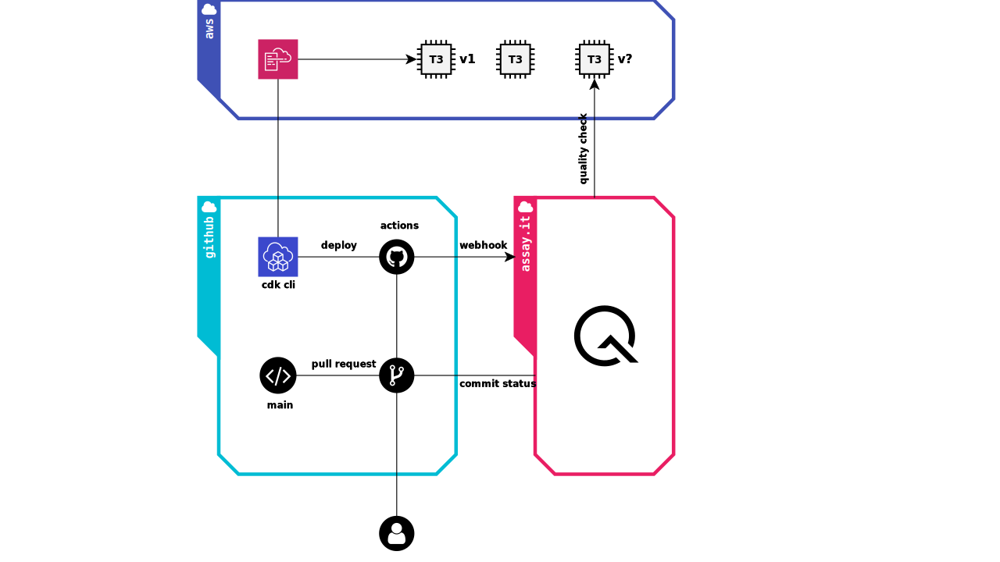

# Advanced Suite Sample

Here is an example application to show https://assay.it in actions. It shows a reference
implementation of [Everything is Continuous](https://doc.assay.it/2020/07/01/Everything-is-Continuous.html) workflow, shows advanced usage of Behavior as a Code paradigm and integration with CI/CD. Please take also a look into [simple suite sample](https://github.com/assay-it/sample.assay.it).


## Inspiration

Microservices have become a design style to evolve systems architecture in parallel,
implement stable and consistent interfaces. This architecture style brings additional
complexity and new problems. One of them is the assessment of system behavior while its
components communicate over the network - like integration testing but for distributed
environment. We need an ability to quantitatively evaluate and trade-off architecture
to ensure quality of the solutions.

https://assay.it is designed to performs a formal (objective) proofs of the quality using
Behavior as a Code paradigm. It connects cause-and-effect (Given/When/Then) to the networking
concepts (Input/Process/Output). The expected behavior of each network component is declared
using simple Golang program.

This example is inspired by the blog post [Everything is Continuous](https://doc.assay.it/2020/07/01/Everything-is-Continuous.html) and provides the reference implementation and the guidance about of the eponymous [workflow](https://doc.assay.it/docs/workflows/everything-is-continuous). 


## Everything is Continuous

Modern software engineering is talking about Continuous Integration, Continuous Delivery and Continuous Deployment. Why should we distinguish them? **"Everything is Continuous"** defines a right philosophy and commitment that ensures the always ready state of your code. It also implements pipelines to deploy every commit straight to sandbox with the following promotion to production.

**"Everything is Continuous"** does not invent any special workflow. It just emphasizes deployment and quality assessment as a key feature along the development process. Continuous proofs of the quality helps to eliminate defects at earlier phases of the feature lifecycle. It impacts on engineering teams philosophy and commitments, ensuring that your microservice(s) are always in a release-ready state. The right implementation of the workflow deploys every commit to disposable sandbox environment with the following promotion to production. This example application implements a reference workflow to emphasis role of [https://assay.it](https://assay.it) as part of pull request
quality check.

Let's take a look:
 
1. The `main` branch of your project is always the latest deployable snapshot of a microservice. CI/CD have to automate the `main` snapshot deployments every time when a new feature is merged. 

2. The feature integration into `main` is implemented through pull request (no exceptions whatsoever).

3. GitHub Actions executes automated pull request deployment to the sandbox environment every time new changes are proposed (each commit). The sandbox environment is a disposable deployment dedicated only for pull request validation.

4. Once the sandbox environment is ready, the integration and behavioral testing phase begins.

5. https://assay.it make a formal proofs of the quality using Behavior as a Code paradigm.

6. Everything is alright, the pull request is merged to `main` branch. 

Exactly same quality assessment technique is applied to the `main` branch and releases - Behavior as a Code runs the quality assessment for each deployment.

## Key features

We build https://assay.it to help developers with quality assessment of microservices in the distributed environment. The service is designed to perform a formal and objective proof of the quality using Behavior as a Code paradigm every time changes are applied to your environment. This examples:

* show https://assay.it and [Everything is Continuous workflow](https://doc.assay.it//docs/workflows/everything-is-continuous) in actions;

* defines the [GitHub Actions](.github/workflows/check.yml) that checks the quality of proposed changes. It is executed for each pull request and its commits;

* implements a naive [News Feed](newsfeed.go) serverless application;

* use TypeScript and AWS CDK to implement [Infrastructure as a Code](cloud) for the serverless application;

* [Behavior as a Code](test) for the quality assessment of the the serverless application.


## Getting Started

**Sign Up** to https://assay.it, **Fork** this repository and play with this example. Let's have a look on the repository content first.

```
/
├── .github/workflows
|   └── check.yml      // GitHub Action, the CI/CD workflow
|
├── cloud
|   ├── index.ts       // Infrastructure as a Code
|   └── ...
|
├── test               // Behavior as a Code
|   ├── elementary.go  // shows unit-test like quality assessment
|   ├── minimal.go     // a minimal BaC suite
|   ├── recursive.go   // demonstrates ability of recursive scenarios
|   └── scenario.go    // shows behavioral scenario, chain of requests to model consumer 
|
├── .assay.json        // the configuration file, lists scenarios to execute
├── newsfeed.go        // the naive News Feed serverless application
```

1. Sign Up for https://assay.it with your GitHub account.

2. Fork the repository to your GitHub account

3. AWS account is required to reveal the whole essence of this example. You need obtain AWS access and secret keys so that GitHub Actions can deploy the application. These keys (`AWS_ACCESS_KEY`, `AWS_SECRET_KEY`) shall be configured to GitHub secrets at your own fork of the repository: example.assay.it > Settings > Secrets. 

4. This example deploys an application under well-known name (e.g. `v1.example.com`). Therefore, a AWS Route53 Hosted Zone is required at your AWS account otherwise the example would not work. Please configure the name of the domain, which is owned by the zone, to `CONFIG_DOMAIN` GitHub Secret variable.

5. Integrate the fork of this repository with https://assay.it, Go To: Account > Setting > Integrate

6. Give GitHub Actions permission to invocate WebHook API on your behalf, Go To Account > Setting > Secrets > New Secret Key. Create a new secret `ASSAY_SECRET_KEY` at GitHub Secret with this value.

7. Make any changes and open a pull request against your fork (e.g. change the `github.actor` condition to your own name at the workflow).

8. Enjoy the results!

What is really happens inside? Let's look on the diagram:



GitHub Actions use our Infrastructure as a Code to continuously deploy changes to the sandbox environment. The deployment is immutable, a new version of the application is created for each distinct pull request. The successful deployment triggers WebHook at https://assay.it. The service checks out defined Behavior as a Code from the repository and applies the quality assessment against the sandbox environment. Results of assessment is published back to pull request. 

## Next Steps

1. Study the [core concepts](https://doc.assay.it/docs/core) behind and [coding style](https://doc.assay.it/docs/core/style) of Behavior as a Code paradigm

2. This example implements an advanced Behavior as a Code at [test](test) folder. Use them as an annotated reference
  * [elementary.go](test/elementary.go) shows unit-test like quality assessment;
  * [minimal.go](test/minimal.go) a minimal BaC suite, use it as template for your work;
  * [scenario.go](test/scenario.go) shows an ability to execute a behavioral scenario, where chain of requests models a typical consumer behavior.
  * [recursive.go](test/recursive.go) demonstrates ability of recursive behavior scenarios.

3. Check our documentations https://doc.assay.it/

## Issues

If you experience any issues with this example, please let us know via [GitHub issues](https://github.com/assay-it/example.assay.it/issues). We appreciate detailed and accurate reports that help us to identity, replicate the issue and advise your with the solution.


## License

[](LICENSE)

