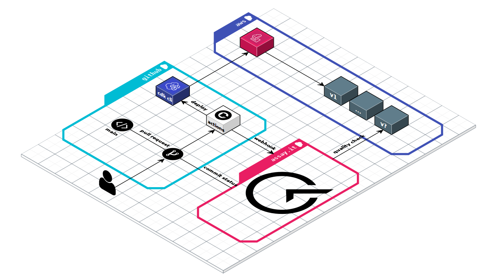

# Advanced Suite Sample

Here is an example application to show https://assay.it in actions. It talks about
advanced topics such as Behavior as a Code development, integration with CI\CD and
depict the workflow. Please look into [simple suite sample](https://github.com/assay-it/sample.assay.it).

## Inspiration

Microservices have become a design style to evolve systems architecture in parallel,
implement stable and consistent interfaces. This architecture style brings additional
complexity and new problems. One of them is the assessment of system behavior while its
components communicate over the network - like integration testing but for distributed
environment. We need an ability to quantitatively evaluate and trade-off architecture
to ensure quality of the solutions.

https://assay.it is designed to performs a formal (objective) proofs of the quality using
Behavior as a Code paradigm. It connects cause-and-effect (Given/When/Then) to the networking
concepts (Input/Process/Output). The expected behavior of each network component is declared
using simple Golang program.

This repository delivers a guidance about the basic features of the service and integration patterns.

## Everything is Continuous

Modern software engineering is talking about Continuous Integration, Continuous Delivery and
Continuous Deployment. Why we should distinguish them? "Everything is Continuous" defines a right philosophy and commitment that ensures always ready state of your code. It also implements pipelines to deploy every commit straight to sandbox with following promotion to production. 

"Everything is Continuous" does not invent any special workflow. It just emphasis deployment
and quality assessment as a key feature along the development process. Continuous proofs of 
the quality helps to eliminate defects at earlier phases of feature lifecycle. Eventually,
each engineering team adopts the workflow suitable for them. This example application implements a reference workflow to emphasis role of https://assay.it as part of pull request
quality check. Let's take a look:
 
1. The `main` branch of your project is always latest deployable snapshot of a software asset. 

2. The feature integration into `main` branch is implemented through pull request.

3. CI\CD (e.g. GitHub Actions) executes automated pull request deployment to sandbox environment every time new changes are proposed (each commit).

4. Once the sandbox environment is ready, the integration and behavioral testing phase begins.

5. https://assay.it make a formal proofs of the quality using Behavior as a Code paradigm.

6. Everything is all right, the pull request is merged to `main` branch. 

You can project same pattern on `main` branch and releases - use Behavior as a Code quality assessment for each deployment.

## Getting Started

This example application shows https://assay.it in actions and few extra things. You can fork this repo and play with it in own account... Let's have a look on the repository:

* It implement a naive [News Feed](newsfeed.go) interface.

* The news feed is deployable as serverless application to AWS. The [cloud](cloud/index.ts) is AWS CDK application that orchestrates deployment.

* GitHub Actions implements [Everything is Continuous workflow](.github/workflows/check.yml).

* Behavior as a Code at [test](test) folder is the core part of the example. It implements a quality assessment of the news feed interface. These suites are executed by https://assay.it against the sandbox environment.
- [elementary.go](test/elementary.go] illustrates an ability to apply unit-test like strategy.
- [minimal.go](test/minimal.go) a minimal suite example.
- [scenario.go](test/scenario.go) shows an ability to execute a behavioral scenario, where chain of requests models a typical consumer behavior.
- [recursive.go](test/recursive.go) demonstrates ability of recursive behavior scenarios.

Are you ready to on-board with this example?

### Requirements

**Note**: the following requirements applies to this example only.

1. You need to have an AWS Account, this example deploys a serverless app.

2. You need to have a Hosted Zone configured in the account, this example uses custom domain for api.

### Let's on-board with this example 

1. Sign Up to https://assay.it
2. Fork the repository to your GitHub account
3. Go To Account > Setting and Integrate your fork (example.assay.it) with https://assay.it
4. Go To Account > Setting > Secrets and generate a New secret key. It is required to integrate the service with CI\CD (GitHub Actions in this example).
5. Define GitHub secrets at your own fork of the repository: example.assay.it > Settings > Secrets.
  * `AWS_ACCESS_KEY` - the access key to access your AWS account
  * `AWS_SECRET_KEY` - the secret key to access your AWS account
  * `CONFIG_DOMAIN` - the domain name to deploy example News Feed API. Your AWS account shall be a owner and contain corresponding AWS Route53 Hosted Zone. 
  * `ASSAY_SECRET_KEY` - secret key generate at previous step.
6. Make any changes and open a pull request against your fork. You might change the `github.actor` condition at the workflow.
7. Enjoy the results!

The entire process is visualized on the diagram:

## Next Steps

1. Study "Behavior as a Code" syntax defined by the [gurl library](https://github.com/fogfish/gurl).

## Issues

If you experience any issues with this example, please let us know via [GitHub issues](https://github.com/assay-it/example.assay.it/issues). We appreciate detailed and accurate reports that help us to identity, replicate the issue and advise your with the solution.

## License

